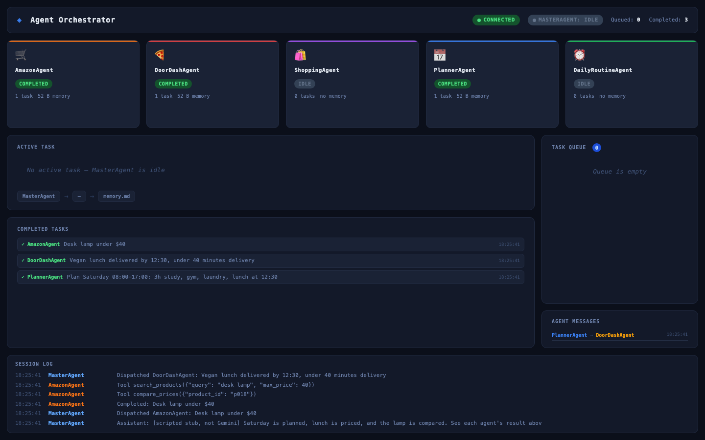

# Agent-Guidelines

[](https://github.com/sandeepvijayarao09/Agent-Guidelines/actions/workflows/tests.yml)
[](LICENSE)

A Gemini master agent that delegates to five specialist agents, each of which calls deterministic Python tools through function calling, with persistent memory and a live dashboard.



*The dashboard after `python scripts/offline_demo.py`. In that demo the model is a scripted stub (no Gemini call); the orchestration, task queue, agent messages, memory and tool calls shown are real.*

## Highlights

- **Two-level function calling.** The master exposes each specialist as a Gemini tool. Each specialist runs its own function-calling loop over its domain tools, so the LLM picks priorities and arguments while Python does the arithmetic.
- **Deterministic, unit-tested tools.** Schedule building, routine timelines, habit streaks, product search, price comparison, budget fitting, restaurant search and order totals are plain functions in `tools/`.
- **Enforced agent flow.** `BaseAgent.run_task` always runs: execute, then a dedicated call that rewrites the agent's markdown memory, then a session-log entry.
- **Persistent state.** A JSON store holds the task queue, completed tasks, the session log and inter-agent messages (`notify_agent` / `read_agent_messages`).
- **Live dashboard.** FastAPI + WebSocket view of agent status, the queue, messages and the log.
- **Offline tests.** 45 pytest tests run against a stubbed Gemini client: no network, no API key. CI runs them on Python 3.11 and 3.12.

## Specialists and their tools

| Agent | Tools | Data |
| --- | --- | --- |
| `PlannerAgent` | `build_schedule` (time-blocks tasks by priority around fixed events, splits long tasks, adds breaks, reports conflicts and overflow), `date_info` | Your input |
| `DailyRoutineAgent` | `routine_timeline` (forward from wake-up or backward from bedtime, checks a time budget), `habit_streaks` | Your input |
| `AmazonAgent` | `search_products` (Amazon listings only), `compare_prices` | **Sample catalog** |
| `ShoppingAgent` | `search_products`, `compare_prices`, `allocate_budget` | **Sample catalog** (budget tool uses your input) |
| `DoorDashAgent` | `search_restaurants`, `estimate_order_total`, `latest_order_time` | **Sample restaurants** |

### What is real and what is sample data

- The orchestration, tool calling, memory, messaging and dashboard are real and run against the Gemini API when you use `master_agent.py`.
- The planner and routine tools work on whatever you give them.
- **The shopping and food tools do not connect to Amazon, Walmart, Target, Best Buy or DoorDash.** They search two committed files of fictional data: [`data/sample_products.json`](data/sample_products.json) (18 made-up products with made-up prices) and [`data/sample_restaurants.json`](data/sample_restaurants.json) (6 made-up restaurants). Every tool result carries a notice saying so, and the agent prompts tell the model to pass that on. Swapping in a real product or restaurant API means replacing the loader in `tools/catalog.py` or `tools/food.py`.
- Nothing places orders or makes purchases.

## Quick start

Requires Python 3.11+.

```bash
git clone https://github.com/sandeepvijayarao09/Agent-Guidelines.git
cd Agent-Guidelines
python -m venv .venv && source .venv/bin/activate
pip install -r requirements-dev.txt
```

### Try it without an API key

```bash
python -m pytest -q                 # 45 offline tests
python scripts/offline_demo.py      # full pipeline with a scripted stub model
AGENT_MEMORY_DIR=memory/demo uvicorn dashboard.app:app --port 8765
# open http://localhost:8765
```

Real output of the offline demo (the lines tagged `[scripted stub, not Gemini]` are canned text that reformats the real tool results):

```text
--- PlannerAgent (completed)
[scripted stub, not Gemini]
08:00-09:30  Study: distributed systems
09:30-09:40  Break
09:40-11:10  Study: distributed systems
11:10-11:20  Break
11:20-12:20  Gym
12:30-13:15  Lunch
13:15-13:45  Laundry

--- DoorDashAgent (completed)
[scripted stub, not Gemini]
Green Fork Kitchen: 1x Tofu Power Bowl, 1x Lemon Lentil Soup. Estimated total $29.78 (subtotal $20.70). Order by 11:55 for 12:30. Results come from bundled SAMPLE restaurant data (fictional menus, prices and fees).

--- AmazonAgent (completed)
[scripted stub, not Gemini]
Brightdesk LED Desk Lamp: Walmart $34.99, Amazon $36.99, Target $39.99. Cheapest: Walmart. Results come from a bundled SAMPLE catalog (fictional products, made-up prices).
```

### Run it with Gemini

```bash
cp .env.example .env                # then set GOOGLE_API_KEY
python master_agent.py
```

Session context can be passed as `key=value` arguments, for example:

```bash
python master_agent.py session_goal="Plan my day and order lunch" dietary_restrictions=vegan
```

Then type requests at the `You:` prompt. In a second terminal, `uvicorn dashboard.app:app --port 8765` shows the live state.

## How it works

1. `MasterAgent.run` sends the conversation to Gemini with the specialists declared as tools (`run_planner_agent`, `run_doordash_agent`, ...).
2. For each specialist call, the master enqueues a task, passes along any unread inbox messages, and calls `agent.run_task`.
3. The specialist's `_call_llm` sends its own tool declarations to Gemini, executes each requested tool locally, returns the results, and repeats (up to 6 rounds) until the model answers in text. Tool errors go back to the model instead of crashing the agent.
4. The result is stored, optionally forwarded to another agent with `notify_agent`, and returned to the master as the function response.
5. The dashboard polls the JSON state and pushes changes over a WebSocket.

## Project structure

```
master_agent.py          Master orchestrator and CLI
config.py                Model, token limits, paths (AGENT_MEMORY_DIR override)
agents/                  BaseAgent (tool loop, memory flow) and the five specialists
tools/                   Deterministic tool functions + Gemini declarations (registry.py)
data/                    Sample product and restaurant data (fictional)
memory/memory_store.py   Persistent JSON state, task queue, messaging
guidelines/              Markdown rules injected into master and specialist prompts
dashboard/               FastAPI + WebSocket server and UI
scripts/offline_demo.py  End-to-end run with a scripted stub model
tests/                   Offline pytest suite (tests/fakes.py is the stub client)
```

## Configuration

`config.py` holds the model id (`gemini-2.5-flash`), output token limits, the tool-round limit and the memory directory. Set `AGENT_MEMORY_DIR` to keep state somewhere other than `memory/`.

## License

[MIT](LICENSE)
